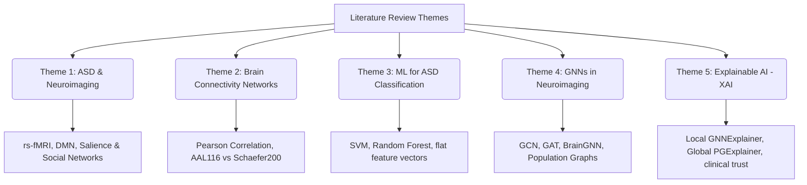

# Interim Research Report: Explainable Graph Neural Networks for Autism Spectrum Disorder Classification Using Functional Brain Connectivity Networks

**Date:** June 28, 2026  
**Research Area:** Neuroimaging, Explainable Artificial Intelligence (XAI), Graph Deep Learning  
**Target Dataset:** Autism Brain Imaging Data Exchange (ABIDE I)  

---

## Executive Summary
This interim report outlines the research framework for developing an explainable Graph Neural Network (GNN) pipeline to classify Autism Spectrum Disorder (ASD) from resting-state functional Magnetic Resonance Imaging (rs-fMRI). Traditional machine learning methods flatten brain connectivity data, discarding the complex spatial topology of neural networks. Conversely, modern deep learning models act as "black boxes," restricting their clinical utility. 

This study addresses both limitations by:
1. Constructing functional brain connectivity networks (graphs) using atlas-based brain parcellation.
2. Building and comparing GNN architectures (GCN, GAT, and BrainGNN) that natively handle graph-structured data.
3. Applying post-hoc explainability methods (GNNExplainer and PGExplainer) to identify key functional subgraphs and regions of interest (ROIs) that drive classification.

The primary objective is to develop a model that achieves high classification accuracy while providing interpretable, neurobiologically grounded explanations for its decisions, thereby bridging the gap between deep learning and clinical neuroscience.

---

## Table of Contents
1. [Chapter 01: Introduction](#chapter-01-introduction)
   - 1.1 Background
   - 1.2 Problem Statement
   - 1.3 Research Aim & Objectives
   - 1.4 Research Questions
   - 1.5 Scope of the Study
   - 1.6 Significance of the Study
   - 1.7 Thesis Structure
2. [Chapter 02: Literature Review](#chapter-02-literature-review)
   - 2.1 Thematic Structure
   - 2.2 Key Papers and Theoretical Foundations
   - 2.3 Critical Analysis & Research Gaps
3. [Chapter 03: Methodology](#chapter-03-methodology)
   - 3.1 Research Design
   - 3.2 Dataset Selection (ABIDE I)
   - 3.3 Proposed Processing Pipeline
   - 3.4 Graph Construction and Feature Engineering
   - 3.5 GNN Model Architectures
   - 3.6 Explainability (XAI) Methods
   - 3.7 Tools & Frameworks
   - 3.8 Evaluation Metrics & Validation Strategy
   - 3.9 Ethical Considerations & Data Governance
4. [Project Work Plan & Milestones](#project-work-plan--milestones)
5. [References](#references)

---

## Chapter 01: Introduction

### 1.1 Background
Autism Spectrum Disorder (ASD) is a complex neurodevelopmental condition characterized by persistent deficits in social communication, restricted interests, and repetitive behaviors. Diagnosing ASD remains a clinical challenge, relying heavily on subjective behavioral observations and diagnostic interviews (e.g., ADOS, ADI-R). In recent years, neuroimaging techniques, particularly resting-state functional Magnetic Resonance Imaging (rs-fMRI), have emerged as promising tools to find objective, physiological biomarkers of ASD. rs-fMRI measures blood-oxygen-level-dependent (BOLD) signal fluctuations while the subject is at rest, allowing researchers to evaluate functional brain connectivity—the temporal correlation of activity between distinct brain regions.

Graph theory provides an intuitive framework for studying these connectivity patterns. By modeling parcellated brain regions as nodes and functional correlations as edges, the brain is represented as a complex network (connectome). While traditional machine learning classifiers (such as Support Vector Machines and Random Forests) have been applied to these networks, they typically require flattening the connectivity matrix into a one-dimensional vector. This flattening process discards the topological structure of the network and ignores spatial relationships between regions. 

Graph Neural Networks (GNNs) offer a powerful alternative. GNNs operate directly on graph structures, leveraging node features and edge connectivity through message-passing mechanisms to learn low-dimensional representations of nodes and entire graphs. This makes GNNs uniquely suited for neuroimaging classification tasks. However, GNNs remain highly complex, non-linear models whose predictions are difficult for clinicians to interpret. To address this, Explainable AI (XAI) methods, such as GNNExplainer and PGExplainer, are integrated into the pipeline to extract the biological substructures driving the classification.

### 1.2 Problem Statement
The clinical adoption of deep learning models for psychiatric and neurodevelopmental diagnostics is restricted by three primary barriers:
1. **The "Black Box" Barrier:** Deep neural networks, including GNNs, are highly non-linear. They produce classification predictions (e.g., ASD vs. Typically Developing) without explaining which connectivity abnormalities or brain regions led to that decision. Clinicians cannot ethically or practically trust a model's prediction without clinical validation of its underlying reasoning.
2. **Topological Information Loss:** Traditional machine learning approaches require flattening symmetric correlation matrices into flat feature vectors. This ignores the structural properties of brain networks, such as modularity, path length, and centrality, which are known to be altered in neurodevelopmental disorders.
3. **Methodological Gap in ASD XAI:** While GNN architectures have been proposed for brain network classification, very few pipelines incorporate post-hoc explainability methods. GNN explanations are rarely validated against established neurobiological literature, particularly regarding Default Mode Network (DMN), Salience Network, and Frontoparietal control systems.

### 1.3 Research Aim & Objectives
**Aim:** To develop, evaluate, and interpret an explainable GNN-based framework for classifying Autism Spectrum Disorder using functional brain connectivity networks derived from resting-state fMRI data.

**Objectives:**
* **Objective 1:** Extract blood-oxygen-level-dependent (BOLD) time-series from the ABIDE I dataset and construct functional connectivity graphs using the Automated Anatomical Labeling (AAL116) atlas.
* **Objective 2:** Implement, train, and optimize Graph Neural Network architectures, specifically Graph Convolutional Networks (GCN), Graph Attention Networks (GAT), and BrainGNN, for binary classification (ASD vs. Typically Developing).
* **Objective 3:** Implement post-hoc local (GNNExplainer) and global (PGExplainer) explainability methods to identify the key nodes, edges, and subgraphs that influence classification decisions.
* **Objective 4:** Quantitatively evaluate classification performance (accuracy, F1-score, AUC-ROC) and explainability quality (fidelity, sparsity) while mapping the identified subgraphs to established neurodevelopmental literature.

### 1.4 Research Questions
* **RQ 1:** Which functional connectivity patterns and networks (e.g., Default Mode Network, Salience Network, Executive Control Network) most distinguish ASD brains from neurotypical controls in graph-structured data?
* **RQ 2:** Can GNN architectures (GCN, GAT, BrainGNN) achieve superior classification performance compared to traditional flat machine learning classifiers (SVM, Random Forest, Multi-layer Perceptron) on functional connectivity networks?
* **RQ 3:** Which brain regions and connectivity edges do GNNExplainer and PGExplainer highlight as most diagnostically significant, and do these align with clinical literature on ASD pathology?

### 1.5 Scope of the Study
The boundary of this research is defined as follows:

| In Scope | Out of Scope |
| :--- | :--- |
| **Dataset:** ABIDE I public dataset (~1,112 subjects). | Longitudinal analysis or multi-site data collection. |
| **Imaging Modality:** Resting-state fMRI (rs-fMRI). | Structural MRI (T1-weighted), Diffusion Tensor Imaging (DTI), EEG, or MEG. |
| **Parcellation Atlas:** AAL116 (Automated Anatomical Labeling). | High-resolution voxel-wise modeling or dynamic functional connectivity. |
| **GNN Architectures:** GCN, GAT, and BrainGNN. | Non-graph deep learning models (except baseline MLPs) or generative models. |
| **XAI Approaches:** GNNExplainer, PGExplainer, and GAT attention weights. | Counterfactual explanations or ante-hoc self-explaining GNNs. |
| **Task:** Binary classification (ASD vs. Typically Developing). | Multi-class classification (e.g., severity levels, ADHD co-morbidity). |

### 1.6 Significance of the Study
This study contributes to both methodology and clinical interpretation by:
* **Bridging Clinical Neuroscience and XAI:** It demonstrates that GNN explanation maps are not just mathematical artifacts, but correspond to recognized neurobiological hubs (such as the precuneus, posterior cingulate cortex, and amygdala) which have clinical significance in ASD.
* **Preserving Topological Integrity:** By utilizing GNNs, the study preserves the natural non-Euclidean topology of the brain, capturing multi-hop relationships and network-level dysfunctions that are lost in standard machine learning pipelines.
* **Providing Diagnostic Support:** Although not a standalone diagnostic tool, an explainable model can serve as a clinical decision support system, providing clinicians with visual evidence (highlighted subgraphs) that justifies the model's classification score.

### 1.7 Thesis Structure
The remaining sections of this research are structured as follows:
* **Chapter 2 (Literature Review):** Surveys the neurobiological theories of ASD, the mathematical formulation of brain graphs, previous machine learning classifiers, modern GNN approaches, and explainability methods, culminating in a synthesis of research gaps.
* **Chapter 3 (Methodology):** Outlines the experimental design, including data acquisition from the ABIDE I database, pre-processing, graph construction, mathematical formulations of the GNN layers, optimization techniques, XAI integration, and performance metrics.
* **Chapter 4 (Project Work Plan):** Establishes the timeline, milestones, and deliverables for completing the implementation.

---

## Chapter 02: Literature Review

### 2.1 Thematic Structure
To establish a solid theoretical foundation, the literature review is organized around five primary themes:



* **ASD and Neuroimaging:** Resting-state fMRI (rs-fMRI) has revealed that ASD is characterized by atypical neural connectivity. Major neurobiological theories describe a pattern of **local over-connectivity** (particularly in sensory areas) and **long-range under-connectivity** (between frontal and posterior regions). Key systems implicated include the Default Mode Network (DMN), the Salience Network (SN), and the Social Brain Network (incorporating the amygdala, fusiform gyrus, and superior temporal sulcus).
* **Brain Connectivity Networks:** Functional connectivity (FC) is defined as the statistical dependency between spatially segregated brain regions. In practice, the brain is segmented using an anatomical atlas (e.g., AAL116, which parcellates the brain into 116 regions of interest, or Schaefer200). The mean time series of BOLD signals is extracted for each region, and a pairwise correlation (typically Pearson correlation) is calculated to construct a symmetric connectivity matrix.
* **Machine Learning for ASD Classification:** Prior attempts to automate ASD classification have relied on classical machine learning. Researchers extract the upper triangle of the symmetric correlation matrix and use it as a flat feature vector. Although classifiers like SVM and Random Forest have shown moderate success, they cannot capture non-local topological properties or multi-scale network dynamics.
* **GNNs in Neuroimaging:** Rather than flattening the data, GNNs model the connectome as a native graph. Graph Convolutional Networks (GCNs) generalize convolutions to non-Euclidean domains, allowing the model to aggregate features from neighboring nodes. Graph Attention Networks (GATs) introduce self-attention, allowing nodes to assign different importances to their neighbors. Specialized architectures, such as **BrainGNN**, use custom pooling layers to preserve ROI-specific properties and enforce sparsity.
* **Explainability (XAI) in Graph Learning:** Standard post-hoc explanations for deep models (like Grad-CAM or integrated gradients) do not translate well to graph structures because they do not account for structural dependency (edges). GNNExplainer and PGExplainer address this by optimizing a mask over the input graph's edges and node features to find the minimum subgraph that preserves the model's prediction.

### 2.2 Key Papers and Theoretical Foundations
The following papers form the baseline and state-of-the-art context for this research:

| Author(s) & Year | Core Focus | Key Findings & Relevance to This Study |
| :--- | :--- | :--- |
| **Heinsfeld et al. (2018)** | Deep Autoencoders & MLP | Used deep learning on the full ABIDE I dataset (1,012 subjects). Achieved 70% classification accuracy. Demonstrated that multi-site variability can be mitigated, but the model remained a black box. |
| **Ktena et al. (2018)** | Spectral Graph CNNs | Developed a metric learning framework using spectral graph convolutions to measure the similarity between brain graphs. Highlighted the power of graph neural networks in capturing structural connections. |
| **Ying et al. (2019)** | GNNExplainer | Introduced GNNExplainer, a local, model-agnostic explainability method. It identifies key subgraphs and node features using mutual information maximization. This will serve as our primary local explainer. |
| **Luo et al. (2020)** | PGExplainer | Proposed PGExplainer, which trains a parametric model (neural network) to predict edge importance globally across an entire dataset. It resolves the computational inefficiency of GNNExplainer. |
| **Li et al. (2021)** | BrainGNN | Introduced BrainGNN, a specialized GNN framework for fMRI. It includes ROI-aware graph convolutions and pooling layers (e.g., IBIS pooling) to automatically select salient nodes, adding interpretability directly to the architecture. |
| **Kan et al. (2022)** | Brain Network Transformer | Developed a Transformer-based model for brain network analysis. While achieving state-of-the-art performance, it emphasizes the need to compare attention-based explanations with post-hoc graph explainers. |

### 2.3 Critical Analysis & Research Gaps
Despite the rapid development of GNNs in medical image analysis, two major gaps persist in the literature:
1. **Lack of Integrated Post-hoc XAI in Clinical Pipelines:** Most existing papers focus solely on maximizing classification accuracy (e.g., pushing from 70% to 75% accuracy). Very few incorporate explainability tools to produce interpretable output maps. The models are presented as high-performing black boxes, which limits their clinical validation.
2. **Lack of Comparative XAI Evaluation:** While attention weights (GAT) are sometimes visualized as explanations, they are rarely compared with post-hoc optimization-based explainers (GNNExplainer, PGExplainer) to evaluate if they point to the same neurobiological pathways. This research addresses this gap by directly comparing these explainability strategies.

---

## Chapter 03: Methodology

### 3.1 Research Design
This study adopts a quantitative, experimental research paradigm. It uses supervised binary classification to distinguish between Autism Spectrum Disorder (ASD) and Typically Developing (TD) subjects. The design is data-driven, leveraging public rs-fMRI repositories, and relies on post-hoc explainability to interpret the trained neural networks.

### 3.2 Dataset Selection (ABIDE I)
Data is sourced from the **Autism Brain Imaging Data Exchange (ABIDE I)**, a collaborative consortium that shares functional and structural brain imaging data.

* **Demographics:** The dataset contains approximately 1,112 subjects (539 ASD, 573 Typically Developing controls).
* **Multi-site Variability:** Data was collected across 17 international imaging sites, introducing variations in scanner strength (1.5T and 3T), repetition time (TR), and demographics. This variability makes it a challenging benchmark for generalizability.
* **Preprocessed Version:** To ensure reproducibility and reduce computational overhead, we will use the **ABIDE Preprocessed** database (available at `nitrc.org/projects/abide_preproc`). We select the **C-PAC pipeline** with the following options: band-pass filtering (0.01–0.1 Hz), global signal regression, and motion correction.

### 3.3 Proposed Processing Pipeline
The complete methodology is structured as a sequential pipeline, running from raw imaging data to GNN explanations:

```
+-------------------------------------------------------------+
|               rs-fMRI Data (ABIDE I Dataset)                |
+-------------------------------------------------------------+
                               |
                               v
+-------------------------------------------------------------+
|     Preprocessing (C-PAC Pipeline: Filtering & Motion)      |
+-------------------------------------------------------------+
                               |
                               v
+-------------------------------------------------------------+
|    Parcellation (AAL116 Atlas: Extracting 116 BOLD series)   |
+-------------------------------------------------------------+
                               |
                               v
+-------------------------------------------------------------+
| Connectivity Matrix (Pearson Correlation: 116x116 per sub) |
+-------------------------------------------------------------+
                               |
                               v
+-------------------------------------------------------------+
| Graph Construction (Thresholding r > 0.5 to form Adjacency) |
+-------------------------------------------------------------+
                               |
                               v
+-------------------------------------------------------------+
|       GNN Classifier (GCN / GAT / BrainGNN Training)        |
+-------------------------------------------------------------+
                               |
                               v
+-------------------------------------------------------------+
| Explainability Phase (GNNExplainer / PGExplainer Masking)   |
+-------------------------------------------------------------+
                               |
                               v
+-------------------------------------------------------------+
| Clinical Validation (Mapping subgraphs to DMN, SN, etc.)    |
+-------------------------------------------------------------+
```

### 3.4 Graph Construction and Feature Engineering
For each subject, a functional brain graph $G = (V, E)$ is constructed:
1. **Nodes ($V$):** The brain is parcellated into $N = 116$ regions of interest (ROIs) using the Automated Anatomical Labeling (AAL116) atlas. Each node $v_i \in V$ represents a distinct brain region.
2. **Edges ($E$):** The mean BOLD time-series $x_i(t)$ is extracted for each ROI $i$. Pairwise functional connectivity is computed using the **Pearson correlation coefficient**:
   
   $$r_{ij} = \frac{\sum_{t=1}^{T} (x_i(t) - \bar{x}_i)(x_j(t) - \bar{x}_j)}{\sqrt{\sum_{t=1}^{T} (x_i(t) - \bar{x}_i)^2 \sum_{t=1}^{T} (x_j(t) - \bar{x}_j)^2}}$$
   
   This yields a symmetric $116 \times 116$ correlation matrix $R$.
3. **Thresholding:** To remove weak, spurious correlations and generate a sparse adjacency matrix $A$, a thresholding function is applied:
   
   $$A_{ij} = \begin{cases} 1, & \text{if } r_{ij} > \theta \\ 0, & \text{otherwise} \end{cases}$$
   
   where $\theta$ is a predefined threshold (e.g., $\theta = 0.5$).
4. **Node Features ($X$):** Initial node features $\mathbf{h}_i \in \mathbb{R}^d$ can be defined using:
   * The raw correlation profile (the row vector $R_{i,:}$ of size 116).
   * Local network topology metrics (e.g., node degree, clustering coefficient, betweenness centrality).
   * The mean or summary statistics of the raw BOLD time-series.

### 3.5 GNN Model Architectures
We implement and compare three models:

#### A. Graph Convolutional Network (GCN)
GCN updates node representations by performing spectral-like convolutions in local neighborhoods. The propagation rule for layer $l$ is:

$$H^{(l+1)} = \sigma \left( \tilde{D}^{-\frac{1}{2}} \tilde{A} \tilde{D}^{-\frac{1}{2}} H^{(l)} W^{(l)} \right)$$

where $\tilde{A} = A + I_N$ is the adjacency matrix with added self-loops, $\tilde{D}$ is the diagonal degree matrix of $\tilde{A}$, $W^{(l)}$ is a trainable weight matrix, and $\sigma$ is an activation function (e.g., ReLU).

#### B. Graph Attention Network (GAT)
GAT introduces attention mechanisms to graph learning, allowing nodes to dynamically weight the importance of neighboring nodes during message passing. The attention coefficient $\alpha_{ij}$ is computed as:

$$\alpha_{ij} = \frac{\exp\left(\text{LeakyReLU}\left(\mathbf{a}^T [\mathbf{W}h_i || \mathbf{W}h_j]\right)\right)}{\sum_{k \in \mathcal{N}(i)} \exp\left(\text{LeakyReLU}\left(\mathbf{a}^T [\mathbf{W}h_i || \mathbf{W}h_k]\right)\right)}$$

where $\mathbf{W}$ is a shared linear transformation, $\mathbf{a}$ is the attention weight vector, $||$ denotes concatenation, and $\mathcal{N}(i)$ is the neighborhood of node $i$.

#### C. BrainGNN
BrainGNN is specifically tailored for brain network analysis. It introduces:
* **ROI-aware Graph Convolutions:** Learns distinct filter weights for different anatomical regions rather than sharing weights globally.
* **Biported Pooling (IBIS):** Selects nodes based on scoring functions that measure their disease relevance, ensuring the downsampled graph retains clinically meaningful structures.

### 3.6 Explainability (XAI) Methods
Post-hoc explainers identify the most influential elements of the input graph for the model's predictions.

#### A. GNNExplainer (Local Explainer)
GNNExplainer extracts a compact subgraph $G_s \subset G$ and a subset of node features $X_s = \{x_j : j \in V_s\}$ that maximize the mutual information with the model's prediction $Y$:

$$\max_{G_s, X_s} MI(Y, G_s, X_s) = H(Y) - H(Y \mid G_s, X_s)$$

where $H(Y)$ is the entropy of the model's prediction. Practically, this is solved by optimizing continuous edge masks $M$ and node feature masks $F$ via gradient descent.

#### B. PGExplainer (Global Explainer)
Unlike GNNExplainer, which optimizes masks for each input graph individually, PGExplainer trains a parametric neural network $f_\psi$ that takes the embeddings of two nodes as input and predicts the probability of their edge being included in the explanation. Once trained, it generates explanations in a single forward pass, making it faster and more capable of capturing global, cohort-wide patterns of ASD.

### 3.7 Tools & Frameworks
The implementation will be written in **Python 3.9+** using the following libraries:
* **PyTorch & PyTorch Geometric (PyG):** Core libraries for building and training GNN models and applying GNNExplainer/PGExplainer.
* **Nilearn:** Loading fMRI data, applying the AAL116 parcellation atlas, and computing Pearson correlation matrices.
* **NetworkX:** Performing graph analyses (degree, centrality) and structuring graph objects.
* **Scikit-learn:** Preparing data, computing evaluation metrics, and running baseline models (SVM, Random Forest).
* **Matplotlib & Seaborn:** Generating visual summaries, connectivity matrices, and mapping brain visualizations.

### 3.8 Evaluation Metrics & Validation Strategy
* **Classification Performance:** Evaluated using Accuracy, Sensitivity (Recall), Specificity, F1-score, and Area Under the ROC Curve (AUC-ROC).
* **Cross-Validation:** A stratified 10-fold cross-validation scheme is used. To prevent data leakage, parcellation, correlation computing, and thresholding are applied strictly within the training folds.
* **Explainability Metrics:**
  * **Sparsity:** The proportion of edges removed in the explanation subgraph.
  * **Fidelity:** The change in the model's prediction score when the explanation subgraph is kept (Fidelity+) or removed (Fidelity-).
  * **Consistency:** The similarity of explanations generated for subjects belonging to the same class.

### 3.9 Ethical Considerations & Data Governance
* **Data Anonymization:** The ABIDE I dataset is fully anonymized. Subject identifiers are scrubbed, and only secondary, de-identified data is analyzed.
* **Institutional Approval:** The original data collection was approved by the Institutional Review Boards (IRB) of the respective 17 participating centers.
* **Clinical Interpretability:** Model outputs and explanations must be presented as research findings, not diagnostic tools. The GNN is designed to assist clinical researchers, not replace clinical diagnosis.

---

## Project Work Plan & Milestones

The proposed 5-week schedule to implement and complete this project is detailed below:

| Phase / Week | Focus Area | Tasks | Deliverables |
| :--- | :--- | :--- | :--- |
| **Week 1** | Data Prep & Setup | Download C-PAC pipeline outputs from NITRC. Set up Python environment. Extract BOLD time-series. | Pipeline setup, basic data-loader scripts. |
| **Week 2** | Graph Construction | Compute correlation matrices. Test threshold values (0.3 to 0.7). Feature engineering for nodes. | Adjacency matrices, node feature matrices. |
| **Week 3** | GNN Implementation | Build GCN, GAT, and BrainGNN architectures. Write training and validation loops. | Trained GNN baseline models. |
| **Week 4** | XAI Integration | Implement GNNExplainer and PGExplainer. Generate edge and node masks. | Visual explanation maps, fidelity metrics. |
| **Week 5** | Analysis & Writing | Compare GNN performance with SVM/RF. Map highlighted ROIs to neuroscience literature. | Complete research thesis draft. |

---

## References

1. **Heinsfeld, A. S., et al. (2018).** Identification of autism spectrum disorder using deep learning and the ABIDE dataset. *NeuroImage: Clinical*, 17, 16-23.
2. **Li, X., et al. (2021).** BrainGNN: Interpretable Brain Graph Neural Network for Predicting Neurological Disorders. *Medical Image Analysis*, 70, 102021.
3. **Ying, R., et al. (2019).** GNNExplainer: Generating Explanations for Graph Neural Networks. *Advances in Neural Information Processing Systems (NeurIPS)*, 32.
4. **Luo, D., et al. (2020).** Parameterized Explainer for Graph Neural Networks. *Advances in Neural Information Processing Systems (NeurIPS)*, 33.
5. **Ktena, S. I., et al. (2018).** Metric learning with spectral graph convolutions on brain connectivity networks. *NeuroImage*, 169, 431-442.
6. **Kan, X., et al. (2022).** Brain Network Transformer for Analyzing Functional Connectome. *IEEE Transactions on Medical Imaging*, 41(11), 3245-3256.
7. **Di Martino, A., et al. (2014).** The Autism Brain Imaging Data Exchange: Towards a large-scale evaluation of the intrinsic brain architecture in autism. *Molecular Psychiatry*, 19(6), 659-667.
